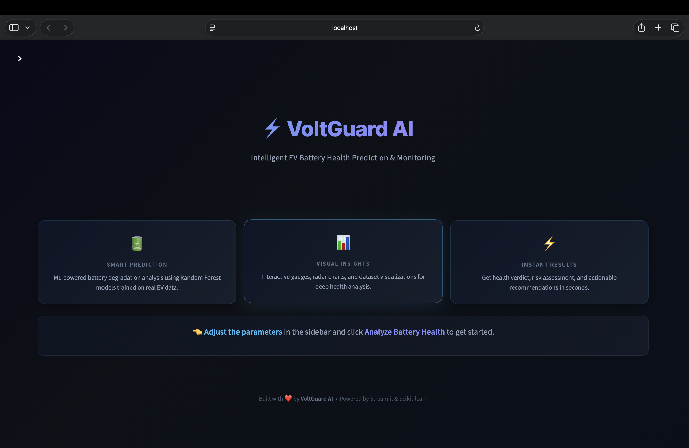
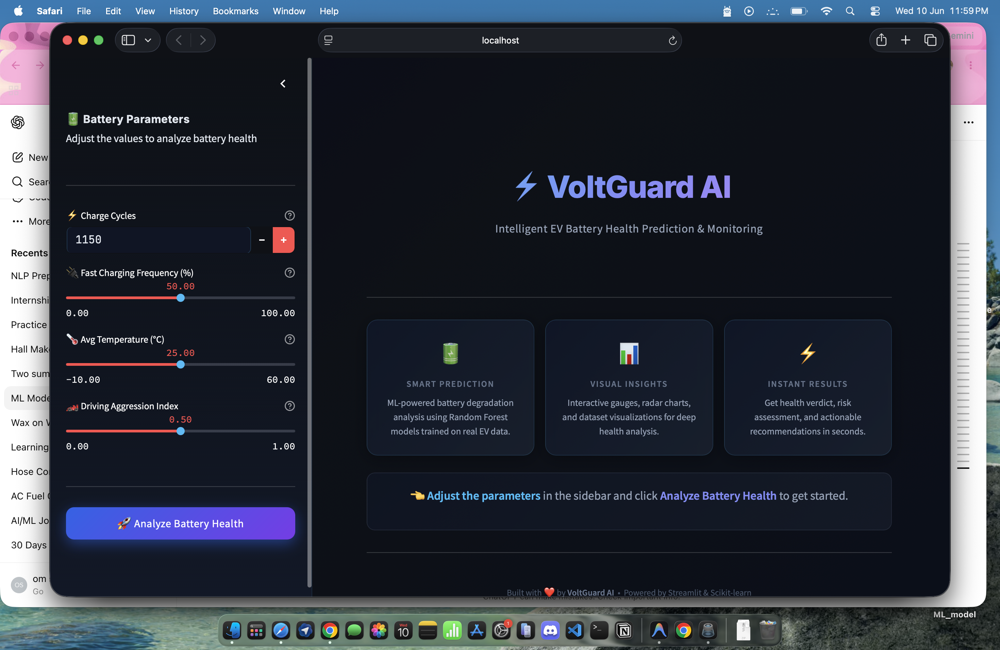
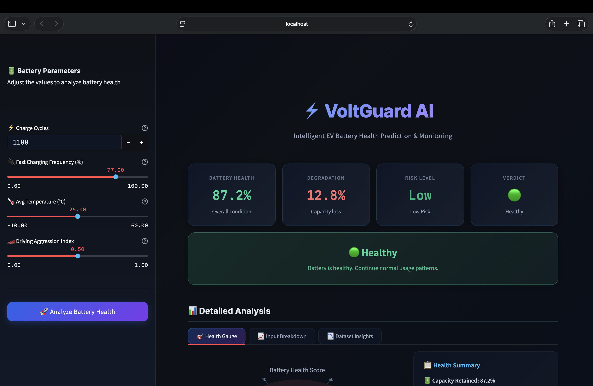
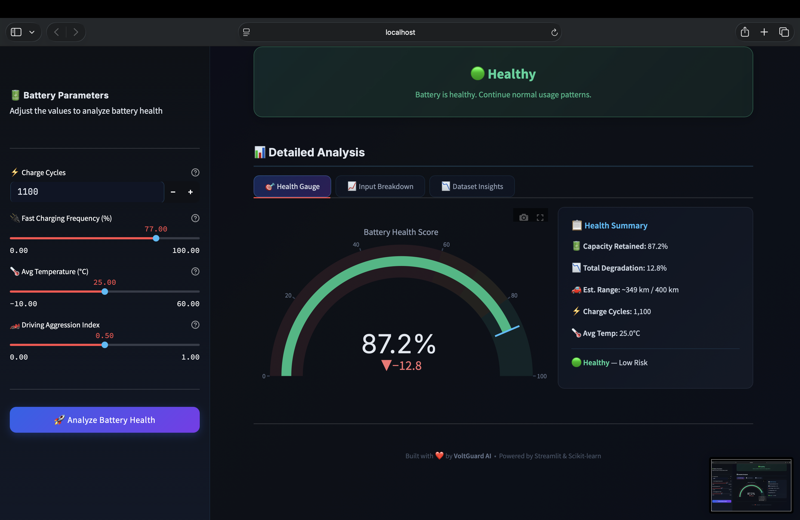
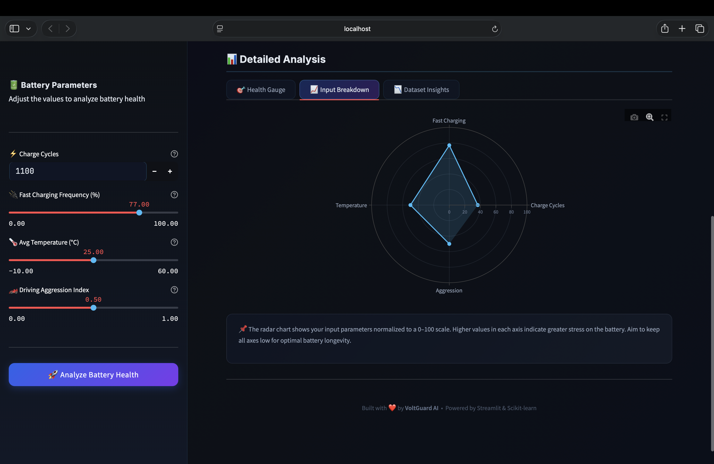

# ⚡ VoltGuard AI

### Intelligent EV Battery Health Prediction & Monitoring System



VoltGuard AI is a Machine Learning-powered EV battery diagnostics platform that predicts battery degradation, estimates battery health, assesses risk levels, and provides actionable recommendations based on battery usage patterns.

Built using Random Forest Regression and deployed through an interactive Streamlit dashboard, VoltGuard AI transforms raw battery parameters into meaningful battery health insights.

---

## 🚀 Features

### 🔋 Battery Health Prediction

Predict battery degradation and battery health using:

* Charge Cycles
* Fast Charging Frequency (%)
* Average Temperature (°C)
* Driving Aggression Index

### 📊 Interactive Analytics Dashboard

* Battery Health Gauge
* Risk Assessment Engine
* Input Breakdown Radar Chart
* Dataset Distribution Analysis
* Correlation Heatmap
* Cycles vs Degradation Visualization

### ⚠️ Smart Risk Assessment

Automatically categorizes battery condition into:

| Battery Health | Status                  |
| -------------- | ----------------------- |
| ≥ 90%          | Excellent               |
| 80% - 89%      | Healthy                 |
| 70% - 79%      | Monitor                 |
| 60% - 69%      | Needs Attention         |
| < 60%          | Replacement Recommended |

### 💡 Intelligent Recommendations

Provides battery maintenance recommendations based on predicted health and degradation levels.

---

## 📸 Application Screenshots

### 🏠 Homepage


---

### 🎛️ Input Control Panel

Adjust battery parameters through an interactive sidebar.



---

### ⚡ Prediction Results

Instant battery health analysis, risk level detection, and verdict generation.



---

### 🔋 Battery Health Gauge

Interactive gauge displaying overall battery health score and detailed summary.



---

### 📊 Dataset Insights & Analytics

Explore degradation distribution, correlation analysis, and dataset patterns.



---

## 🧠 Machine Learning Workflow

### 1️⃣ Data Exploration

* Dataset Inspection
* Missing Value Analysis
* Statistical Summary
* Histograms
* Correlation Analysis

### 2️⃣ Data Preparation

* Feature Selection
* Train-Test Split
* Model Training

### 3️⃣ Model Comparison

#### Linear Regression

| Metric   | Score |
| -------- | ----- |
| MAE      | 1.33  |
| R² Score | 0.754 |

#### Random Forest Regressor

| Metric   | Score |
| -------- | ----- |
| MAE      | 1.27  |
| R² Score | 0.774 |

Random Forest was selected as the final model because it achieved superior predictive performance.

---

## 📈 Feature Importance Analysis

| Feature                  | Importance |
| ------------------------ | ---------- |
| Charge Cycles            | 40.6%      |
| Driving Aggression Index | 30.8%      |
| Average Temperature      | 21.0%      |
| Fast Charging Frequency  | 7.6%       |

### Key Finding

The model reveals that battery degradation is influenced more by:

* Charge Cycles
* Driving Behavior
* Operating Temperature

than by Fast Charging Frequency.

---

## 🛠️ Tech Stack

### Machine Learning

* Python
* Pandas
* NumPy
* Scikit-Learn
* Random Forest Regression
* Joblib

### Visualization

* Plotly
* Matplotlib

### Frontend

* Streamlit
* Custom CSS

---

## 📂 Project Structure

```bash
VoltGuard-AI/
│
├── screenshots/
│   ├── 01_homepage.png
│   ├── 02_input_panel.png
│   ├── 03_prediction_results.png
│   ├── 04_health_gauge.png
│   └── 05_dataset_insights.png
│
├── app.py
├── battery_predictor.py
├── data_exploration.py
├── model_training.py
├── ev_battery_model.pkl
├── ev_battery_dataset.csv
├── requirements.txt
└── README.md
```

## ▶️ Installation

Clone the repository:

```bash
git clone https://github.com/OmShelar2004/Voltguard-AI.git
```

Move into the project directory:

```bash
cd Voltguard-AI
```

Install dependencies:

```bash
pip install -r requirements.txt
```

Run the application:

```bash
streamlit run app.py
```

---

## 🎯 Sample Prediction

### Input

```text
Charge Cycles: 1100
Fast Charging Frequency: 77%
Average Temperature: 25°C
Driving Aggression Index: 0.5
```

### Output

```text
Battery Health: 87.2%
Battery Degradation: 12.8%
Risk Level: Low
Verdict: Healthy
```

---

## 🔮 Future Improvements

* Remaining Useful Life (RUL) Prediction
* Real-Time EV Telemetry Integration
* Battery Health Forecasting
* Cloud Deployment
* Mobile Application
* Explainable AI using SHAP

---

## 👨‍💻 Author

### Om Shelar

AIML Student | Machine Learning Enthusiast | Future EV & AI Engineer

---

⭐ If you found this project interesting, consider giving it a star.
